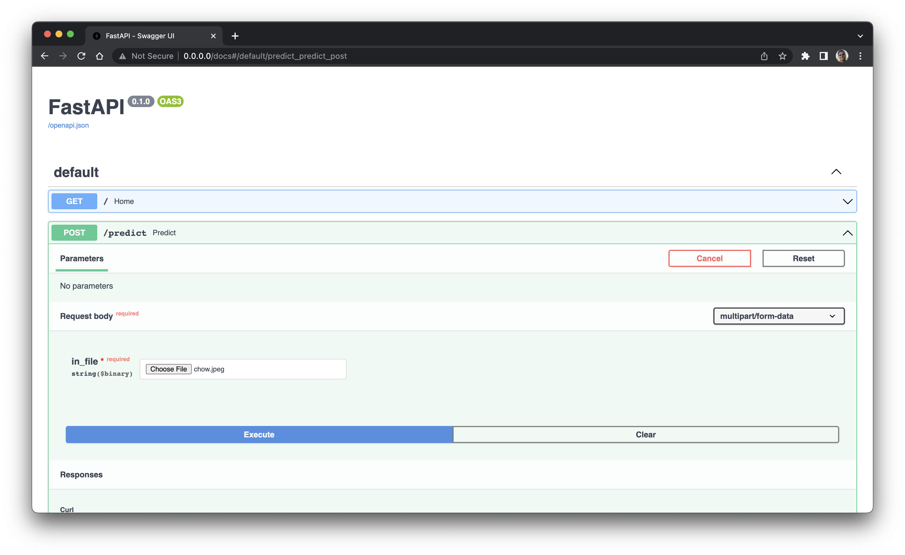
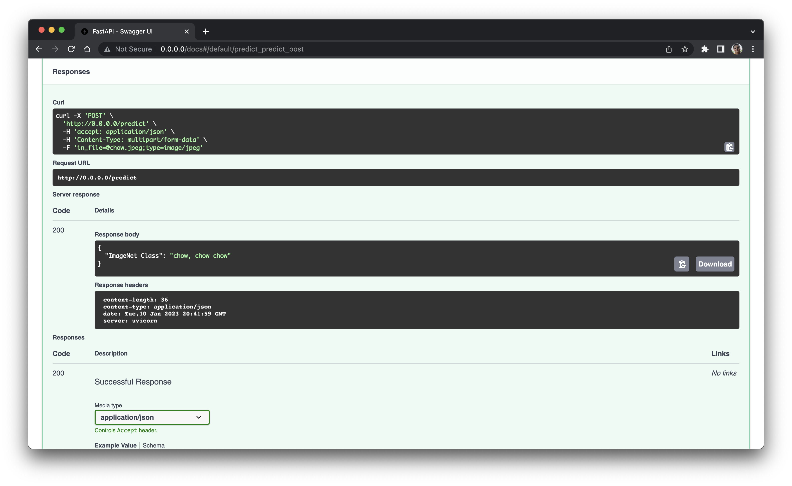
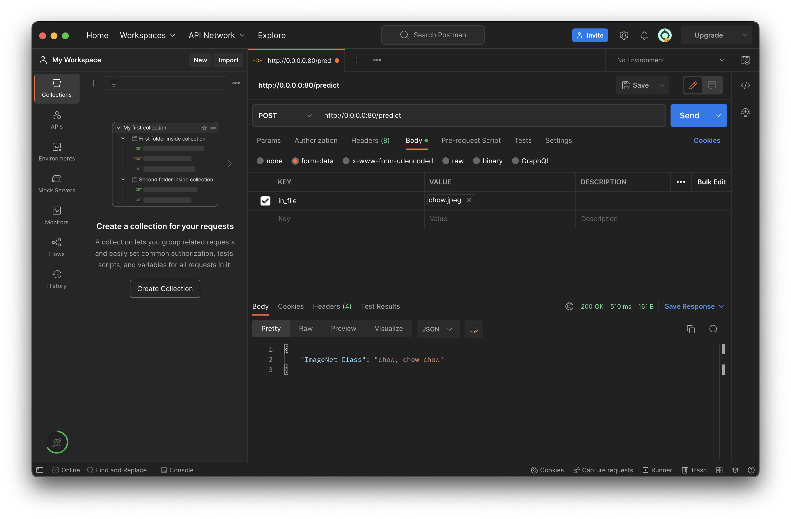
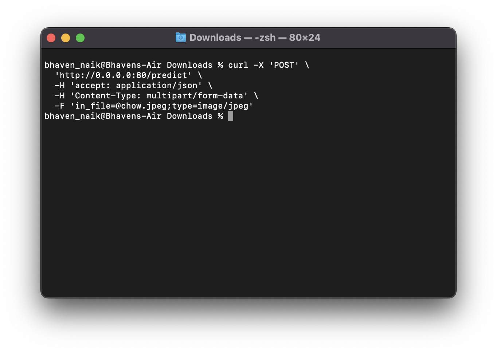

# Model Deployment Demonstration

## Overview

This repository is a demonstration for deploying Machine Learning API as a Docker Image which can be run inside a Docker container. It uses Inference models from the [huggingface](https://huggingface.co/models) model hub.

## Installing and Running the Demo

Steps to **run** the docker container:

- First clone the repository using the command `git clone repo-url `. Open it using **Visual Studio Code** or any editor of our choosing.
- We need to have docker installed on our system. The docker image can either be created (in the root directory which has the Dockerfile) using the command `docker build -t name-of-your-choice .` or pulled from docker hub using the command `docker pull bhaven123/ml-api-demo:latest ` .
- Once we have the image, we can run it inside a container using the command `docker run -p 80:80 image-name `.
- We can see the container running on the port 80 by typing the command `http://0.0.0.0:80 `in the brower's address bar.

Steps to make **POST** requests to the container endpoint:

Now that we have our container running, we can start making POST requests to it. This can be done in the following ways:

- Using **Swapper UI** from **FastAPI**.

  - In our browser window, we can go the route `http://0.0.0.0:80`/`docs `, which will open the Swagger UI. Then we can expand the **POST / predict** and click on **Try it out**, which will open the following as seen in the screenshot below.
  - Now, we can choose any of the images provided in the **app** folder or any image belonging to the classes of **ImageNet-21k** dataset and upload it. As a final step, you can click on execute and check the response.

- Using **Postman**.

  - We can use the very popular Postman API platform to handle the POST requests to our constainer. Simply create a new **HTTP request** in Postman and select the method as **POST**.
  - Now, we can copy paste our container url and select the predict route `http://0.0.0.0:80/predict `.
  - Then, we can go to **Body** and select **form-data**, and upload our input image by selecting file from the drop-down list in the **KEY** column, and choose the name as **in_file** as per the request body in FastAPI app.
  - Finally, we can click Send and see the response below.

    

- Using **Curl**

  - We can also use curl to process our POST request, using the command `curl -X 'POST' \ 'http://0.0.0.0:80/predict' \ -H 'accept: application/json' \ -H 'Content-Type: multipart/form-data' \ -F 'in_file=@chow.jpeg;type=image/jpeg'` which can also be seen in the FastAPI Swagger UI.## 

## Helpful Links

- [Huggingface Inference API](https://huggingface.co/docs/api-inference/quicktour)
- [FastAPI in Containers](https://fastapi.tiangolo.com/deployment/docker/#official-docker-image-with-gunicorn-uvicorn)
- [Upload Images in FastAPI](https://www.youtube.com/watch?v=N6bpBkwFdc8)
